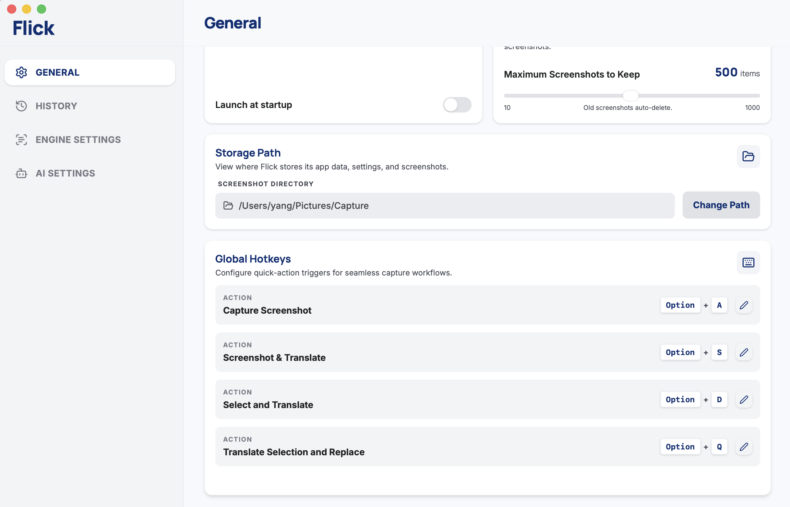
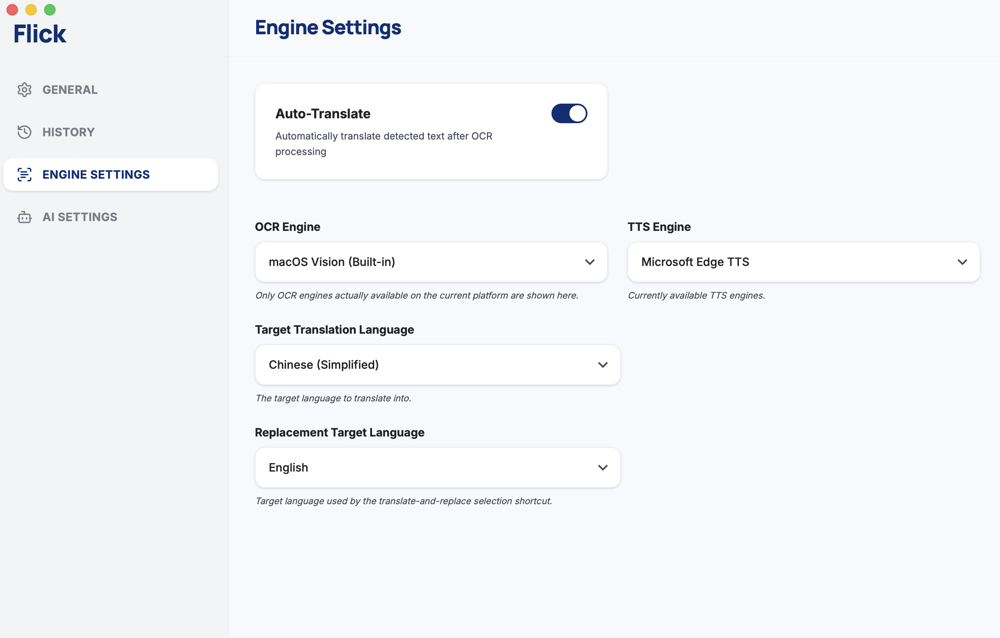
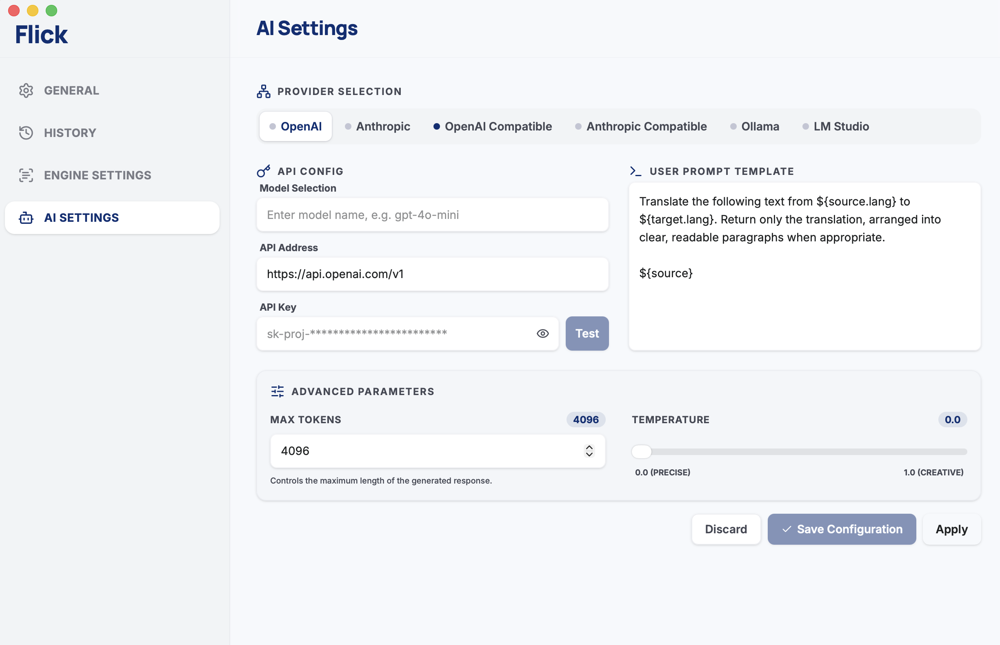

# Flick

Flick is a desktop screenshot, OCR, and AI translation tool built with Tauri, Rust, React, and Vite. It is designed for quick capture workflows, selected-text translation, and local translation history.

## Features

- Screenshot capture with configurable global hotkeys.
- Screenshot-to-translation workflow: capture a region, run OCR, and send detected text to the configured AI provider.
- Selected-text translation and translate-and-replace shortcuts.
- Platform-aware OCR engines:
  - macOS Vision OCR on macOS.
  - Windows built-in OCR on Windows.
  - Bundled Paddle OCR v5 mobile ONNX models where available.
- AI translation providers:
  - OpenAI.
  - Anthropic.
  - OpenAI-compatible endpoints.
  - Anthropic-compatible endpoints.
  - Ollama.
  - LM Studio.
- Microsoft Edge TTS playback for source and translated text when available.
- Local screenshot history and translation history.
- Configurable screenshot retention and screenshot storage path.
- Launch-at-startup support.
- Interface languages: English, Simplified Chinese, and Japanese.

## Screenshots

<p>
  
  
  
</p>

## Requirements

- Rust/Cargo with support for Rust edition 2024.
- Node.js and npm.
- Tauri desktop build dependencies for your target platform.

Platform notes:

- macOS: install Xcode Command Line Tools. For signed local macOS builds, run `./scripts/create_macos_self_signed_cert.sh` once, then use the signed build script. Flick may also require the following permissions in System Settings depending on the features you use:
  - Screen Recording: required for screenshot capture and screenshot OCR.
  - Accessibility: required for selected-text translation, translate-and-replace, and other workflows that interact with the active app.
- Windows: install Microsoft Visual Studio Build Tools with the C++ desktop workload. WebView2 Runtime is required by Tauri apps and is normally already present on current Windows systems.
- Linux: install the GTK/WebKit and related desktop libraries. Due to Wayland's security model, global hotkeys and screenshot capture are not available in Wayland sessions; use an X11 session for those features. On Ubuntu/Debian-based systems, this repository includes a helper target:

```bash
make setup-linux-deps-ubuntu
```

## Development

Install frontend dependencies:

```bash
cd frontend
npm install
```

Run the desktop app in development mode:

```bash
npm run tauri:dev
```

Run the TypeScript check:

```bash
npm run lint
```

## Build

From the `frontend` directory:

```bash
npm run tauri:build
```

The release output is written under:

```text
target/release/bundle/
```

You can also use the top-level Makefile from the repository root:

```bash
make build-release
```

On macOS, `make build-release` calls the signed build script. If the signing identity is missing, create the local self-signed certificate first:

```bash
./scripts/create_macos_self_signed_cert.sh
make build-release
```

On Windows, you can also run:

```powershell
.\scripts\build-release-windows.ps1
```

## Install

Build the app first, then install the artifact generated for your platform from `target/release/bundle/`:

- macOS: open the generated `.dmg` and drag Flick into Applications.
- Windows: run the generated `.msi` or `.exe` installer.
- Linux: install the generated Linux package for your distribution, or run the generated binary if you are using an unpacked build.

macOS Gatekeeper note: current macOS builds are signed with a local self-signed certificate and are not Apple-notarized. This is enough for local signing, but it does not pass macOS Gatekeeper for downloaded builds. If macOS blocks the app, only open it if you trust the build source; you may need to open it from Finder with right-click > Open, or remove the quarantine attribute for your local build.

## Versioning

The application version is maintained in one place:

```text
src-tauri/Cargo.toml
```

Tauri reads the version from Cargo when `src-tauri/tauri.conf.json` does not define its own `version` field.

## License

Flick is licensed under the GNU General Public License version 3.0. See [LICENSE](LICENSE) for the full license text.

The bundled Paddle OCR v5 mobile ONNX assets are derived from the official [PaddleOCR](https://github.com/PaddlePaddle/PaddleOCR) project and are provided under the [Apache License 2.0](https://github.com/PaddlePaddle/PaddleOCR/blob/main/LICENSE). See [src-tauri/resources/ocr/paddle_ocr_v5_mobile/README.md](src-tauri/resources/ocr/paddle_ocr_v5_mobile/README.md) for details.

## Contributors

<a href="https://github.com/flick-translater/flick/graphs/contributors">
  
</a>

## Star History

[](https://www.star-history.com/#flick-translater/flick&Date)
